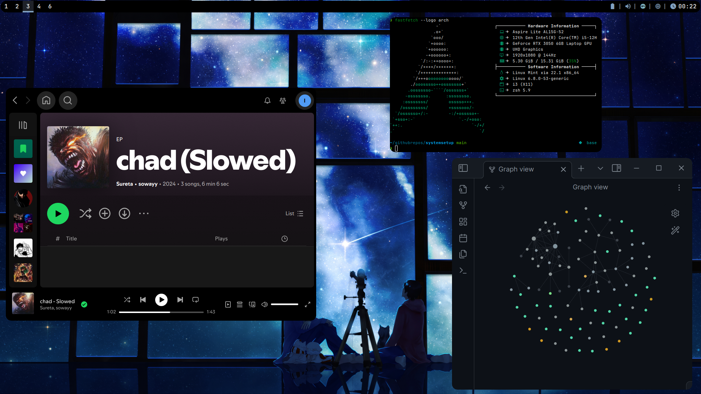
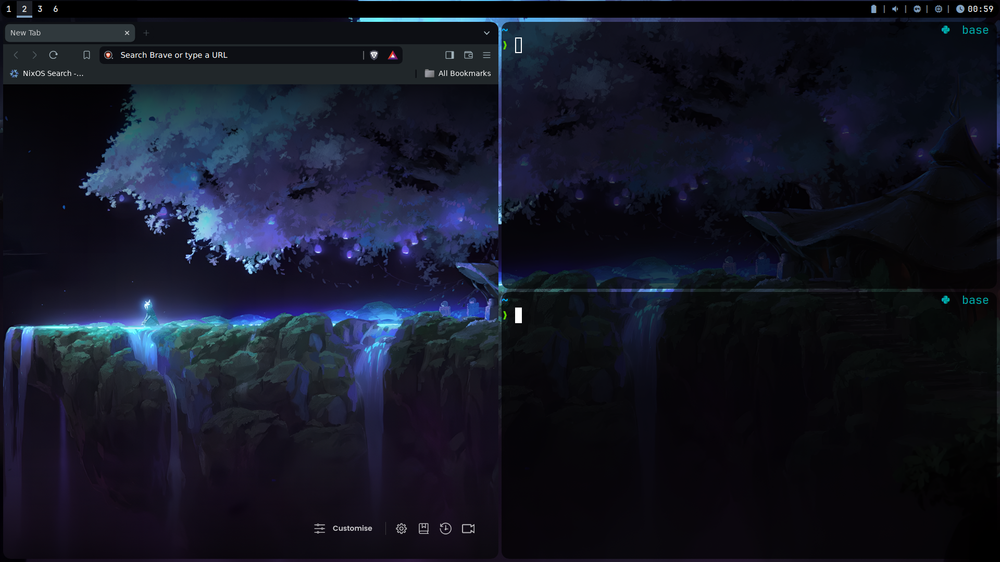

# System Setup

<div align="center">
  <div style="display: flex; flex-wrap: wrap; justify-content: center; gap: 20px;">
    
    
    <!-- Add more img tags here if you have more screenshots -->
  </div>
</div>

### Base System: Linux Mint

### Core Components
*   Nix Package Manager
*   Git
*   Docker
*   Distrobox
*   Zsh (Assumed configured, e.g., with Powerlevel10k)

### Window Management & Desktop Environment
*   i3 (Window Manager)
*   Picom (Compositor)
*   Nitrogen (Wallpaper Manager)
*   Thunar (File Manager)
*   Alacritty (Terminal)
*   JetbrainsMonoNerdFont (Font)

### Development Tools
*   Neovim (Editor)
*   VSCode
*   Node.js
*   Arduino CLI
*   Arduino IDE
*   Git (Version Control)

### Productivity & Utilities
*   Brave (Web Browser)
*   Obsidian (Note-taking)
*   Ranger (Terminal File Manager)
*   fzf (Command-line Fuzzy Finder)
*   zoxide (Smarter Directory Changer)
*   ripgrep (Recursive Line Searcher)
*   fd (Simple Find Alternative)
*   tmux (Terminal Multiplexer)
*   tmate (Instant Terminal Sharing)
*   btop (Resource Monitor)
*   fastfetch (System Information Tool)
*   tgpt (Terminal GPT Client)
*   qpdfview (PDF Viewer)
*   Shutter (Screenshot Tool)
*   SimpleScreenRecorder (Screen Recorder)

### Media & Communication
*   Spotify
*   VLC (Media Player)
*   Discord
*   WhatsApp for Linux

### Cloning and Setup

1.  **Clone the repository:**
    ```bash
    git clone https://github.com/your-username/systemsetup.git ~/systemsetup
    cd ~/systemsetup
    ```
    *(Replace `your-username` with your actual GitHub username)*

2.  **Copy Configuration Files:**
    Carefully copy the desired configuration files from the cloned repository's `.config` directory to your local `~/.config` directory. **Warning:** This might overwrite your existing configurations. Back up your current configurations first.
    ```bash
    # Example: Copying Neovim config
    # cp -r .config/nvim ~/.config/nvim

    # Example: Copying i3 config
    # cp -r .config/i3 ~/.config/i3

    # ... copy other desired configs ...
    ```
    Also copy dotfiles from the repository root to your home directory:
    ```bash
    # Example: Copying .zshrc
    # cp .zshrc ~/.zshrc

    # Example: Copying .p10k.zsh
    # cp .p10k.zsh ~/.p10k.zsh
    ```

### Configuration Files
*   Most application configurations are stored within the `.config` directory in this repository and are intended to be copied to the user's `~/.config` directory.
*   Key configurations include: Neovim (`.config/nvim/`), i3 (`.config/i3/`), Picom (`.config/picom/`), Alacritty (`.config/alacritty/`), Zsh (`.zshrc`, `.p10k.zsh`), etc.

### Games
*   Minecraft
🤖 This is a temporary line: 2025-08-12 13:43:15
